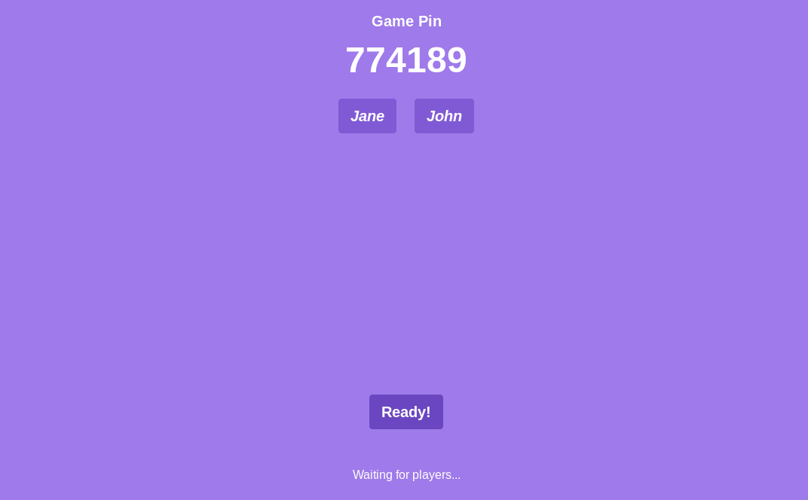

# Livewire Quiz

A self-hosted Quiz application (just like Kahoot). It is built with Laravel and Livewire.

### Getting started
- Clone the app `git clone https://github.com/rumansaleem/livewire-quiz`.
- Install Composer dependencies `composer install`.
- Copy `.env.example` file to `.env`.
- Edit `.env` according to your own database credentials.
- Generate application key `php artisan key:generate`.
- Run Migrations and seed Data `php artisan migrate --seed`.
- Serve Websockets `php artisan webosockets:serve`.
- Serve Application `php artisan serve`.

Access admin's side on `/admin` with whatever password you have set to `ADMIN_PASSWORD` in your `.env`, Feel free to customise this.

If you find any problem, feel free to open an issue.

Thanks for checking out!
